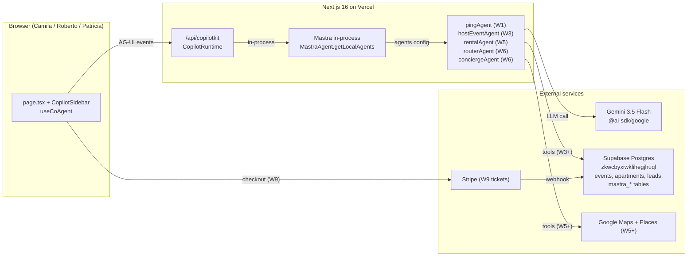

# mdeapp — Architecture (5-minute overview)

> 5-min onboarding for the new mdeai application. For depth, read [`/home/sk/mdeai/plan/prd.md`](../../plan/prd.md) and its 10 chunks under `plan/prd/`.

## 1. TL;DR

`mdeapp/` is a Next.js 16 (App Router + Turbopack + Tailwind v4 + React 19) chat-first app. CopilotKit 1.55.2 renders the UI; Mastra (beta) runs agents in-process behind a single `/api/copilotkit` endpoint; agents call Gemini 3.5 Flash and Supabase. Phase 1 ships **Roberto's host-event wizard** (`/host/event/new`, W3–W4) and **Camila's rentals + chat** (`/rentals`, `/chat`, W5–W7). Stripe ticketing (W9) and cutover from legacy `/home/sk/mde/` (W10) close the phase.

## 2. System diagram

## 3. Data flow per surface

| Surface | Persona | Agent | Tools (when wired) | Supabase tables touched |
|---|---|---|---|---|
| `/` chat shell | All | `pingAgent` (W1) → `conciergeAgent` (W6) | none in W1; `search_*` in W6 | `mastra_messages`, `mastra_threads`, `mastra_ai_spans` |
| `/host/event/new` | Roberto | `hostEventAgent` (W3) | `set_event_basics`, `set_venue`, `add_ticket_tier`, `preview_and_publish` (HITL) | `events`, `mastra_workflow_snapshot` (HITL pause) |
| `/host/events` | Roberto | none — list view | none | `events` (read) |
| `/rentals` | Camila | `rentalAgent` (W5) | `search_rentals`, `search_grounded_places` | `apartments`, `listing_embeddings` |
| `/chat` | Camila / Tourist | `routerAgent` (W6) → `rentalAgent` / `conciergeAgent` | `classify_intent`, all `search_*` | all of the above + `restaurants`, `tourist_destinations` |
| `/login` | Roberto / Camila | none — auth only | none | `auth.users`, `auth.sessions` |
| `/api/copilotkit` | n/a | runtime endpoint | n/a | none directly |
| Stripe webhook (W9) | Andrés / Miguel | none — edge fn | n/a | `event_orders`, `idempotency_keys` |

## 4. Invariants (hard rules — break = revert)

1. **Agent name match.** The string in `useCoAgent({ name: "X" })` must equal a key in `Mastra({ agents: { X } })`. Mismatch = silent 404 on chat. See [CLAUDE.md](../../CLAUDE.md) "Architecture".
2. **Single `setPins` writer (PRD §18 RUNTIME-008).** Map pins are written **only** by the agent state path, never by component-local state. Multiple writers = pin flicker + race conditions.
3. **Gemini only in production.** No `@anthropic-ai/*` SDK in `mdeapp/` or edge functions. Model is `gemini-3.5-flash`; see [CLAUDE.md Gemini model registry](../../CLAUDE.md).
4. **No service-role keys in `src/**`.** They live only in Supabase Edge Functions. The `no-service-role-in-src.mjs` hook enforces.
5. **CopilotKit pinned at 1.55.2.** v2 migration is Phase 2; don't mix imports.

## 5. Where do I add X?

| Adding… | Location | Skill | Test |
|---|---|---|---|
| **A new agent** (e.g. `hostEventAgent`) | `src/mastra/agents/<name>.ts` + register key in `src/mastra/index.ts` | `mastra`, `copilotkit-integrations` | smoke test in `src/__tests__/` |
| **A new tool** (e.g. `search_rentals`) | `src/mastra/tools/<name>.ts` + import into the agent's `tools: { ... }` | `mastra`, `mde-supabase` (for DB tools), `mde-maps` (for Places) | Vitest unit test mocking the DB client |
| **A new workflow** | `src/mastra/workflows/<name>.ts` + register on Mastra | `mastra` | run via `mastra dev` Studio @ `localhost:4111` |
| **A new page / route** | `src/app/<route>/page.tsx` | `vercel:nextjs` | Playwright e2e (W3+) |
| **A new shadcn component** | `npx shadcn@latest add <name>` → `src/components/ui/<name>.tsx` | `vercel:shadcn`, `react-best-practices` | visual check via chrome-devtools MCP |
| **A new edge function** | `mdeapp/supabase/functions/<slug>/index.ts` + `config.toml` | `supabase-edge-functions`, `mde-supabase` | curl smoke + Supabase MCP `get_edge_function` after deploy |
| **A new Supabase table** | `mdeapp/supabase/migrations/<ts>_<name>.sql` + RLS + ≥1 policy | `mde-supabase` | `mcp__ed3787fc-…__execute_sql` schema query + RLS audit |
| **A new env var** | both `mdeapp/.env.local` (dev) and Vercel project env (`vercel env add`) — never commit secrets | `mde-vercel` | hook `scan-secrets.mjs` blocks accidental commits |
| **A new test** | colocated `*.test.ts` next to source, or under `src/__tests__/` | `testing`, `javascript-testing-patterns` | `npm test` |

## 6. Test contract

`npm run floor` is the single gate. Five sub-gates in order: lint → typecheck → build → test → audit. All must exit 0. See [F09 evidence](../../tasks/notes/F09-evidence.md) for the canonical baseline (4/4 tests in 532ms). `/verify-floor` slash command delegates to it.

E2E (Playwright) lands W3+ at `mdeapp/playwright/`. Chrome-devtools MCP is the workshop tool for "did this UI change actually render?" checks during dev.

## 7. Pointers

- **PRD (depth):** [`plan/prd.md`](../../plan/prd.md) — 10 chunks `00-foundation` → `10-summary`.
- **Task backlog:** [`tasks/INDEX.md`](../../tasks/INDEX.md). Foundation specs in [`tasks/core/`](../../tasks/core/).
- **Audits (truth + corrections):** [`tasks/audit/04-VERIFICATION-of-02-and-03.md`](../../tasks/audit/04-VERIFICATION-of-02-and-03.md), [`tasks/audit/05-verifier-blocker-patches.md`](../../tasks/audit/05-verifier-blocker-patches.md).
- **Verified setup checklist:** [`plan/audit/05-copilotkit-mastra-setup-checklist.md`](../../plan/audit/05-copilotkit-mastra-setup-checklist.md) — 38-item match against the upstream CopilotKit+Mastra example.
- **Path A migration plan:** [`plan/05-path-a-mastra-migration.md`](../../plan/05-path-a-mastra-migration.md) — ports from legacy `my-mastra-app`.
- **Project rules + Gemini registry + MCP cadence:** [`CLAUDE.md`](../../CLAUDE.md).
- **Legacy hard-freeze:** [`/home/sk/mde/FREEZE.md`](../../../mde/FREEZE.md) — effective 2026-05-26.
