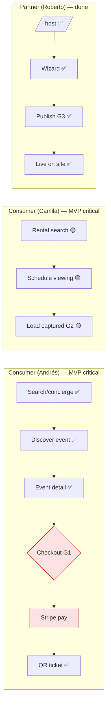

# MVP Readiness Audit & Execution Plan

> Ruthless, launch-first audit of the Sanjiovani team's Linear state (2026-06-06). **Priority = ship the MVP, not add features.**
> **Critical framing:** there are **two MVP lenses** and they must not be conflated:
> - **Vertical-breadth lens** (`docs/dashboard.md`): ~24% weighted — how many verticals are fully built. *Not the launch bar.*
> - **Launch-exit lens** (`tasks/MVP-REQUIRED.md` + `phase:launch`): **foundation ~98% shipped; gated on the commerce proof chain.** *This is the launch bar — this audit uses it.*
> **Verified against:** the 22 `phase:launch` issues + the Core Foundation / Events / Platform-Infra projects.

---

## Executive summary

**You are close.** Against the launch-exit lens, the hard foundation is done: production auth + OAuth smoke ✅, host-publish prod proof (G3) ✅, Stripe webhook secret isolation ✅, Stable-Beta soak gate (4 nightly greens) ✅, Map ID on prod ✅, `venue_signals` seed ✅, concierge restored on prod ✅. **64+ PRs merged.**

**MVP launch is now gated on one short chain + a few reliability bugs — not on building verticals.** The keystone is **PAY-001 (live ticket purchase on production)**, which unblocks **EVT-001 (launch-proof sign-off)**. Around it sit three prod reliability defects (ai_runs regression, thread persistence on cold-start, hybrid-embed 403) and the prod journey matrix.

**The single biggest risk to launch is scope, not capability.** The Partners platform (40+ issues), the Medusa commerce marketplace, Chatwoot/Postiz/OpenClaw, `create_checkout`/Connect, Trips, Fashion, and even my own improvement-roadmap Phase 1+ are **all post-MVP**. None should be touched until PAY-001 → EVT-001 is green.

**MVP launch readiness: 🟡 82/100.** ~8 concrete tasks to green, one of them (PAY-001) the keystone.

---

## Final scores (launch lens)

| Area | Score | Status |
|---|---|---|
| **MVP readiness (overall)** | 82 | 🟡 |
| Frontend | 80 | 🟡 |
| Backend | 85 | 🟢 |
| AI | 75 | 🟡 |
| Revenue | 60 | 🔴 |
| Maps | 85 | 🟢 |

Revenue is the laggard **only because no live sale has been proven** — the rails exist; PAY-001 closes it.

---

## Step 1 — MVP classification of active launch work

| Task (SAN) | Core | MVP-required | Post-MVP | Nice | Remove | Status |
|---|---|---|---|---|---|---|
| AUTH-011 prod auth (367) | ✅ | ✅ | | | | ✅ Done |
| EVT-002 host publish G3 (366) | ✅ | ✅ | | | | ✅ Done |
| PAY-003 webhook isolation (116) | ✅ | ✅ | | | | ✅ Done |
| OPS-001 soak gate (462) | ✅ | ✅ | | | | ✅ Done |
| MAP-008B Map ID (369) | ✅ | ✅ | | | | ✅ Done |
| **PAY-001 live ticket (178)** | ✅ | ✅ | | | | 🔴 **Todo (keystone)** |
| **EVT-001 launch-proof ledger (115)** | ✅ | ✅ | | | | 🔴 Todo (blocked by PAY-001) |
| **OBS-001 ai_runs regression (704)** | ✅ | ✅ | | | | 🔴 Backlog (prod bug) |
| **F13 thread persistence (548)** | ✅ | ✅ | | | | 🔴 Todo |
| **DATA-EMBED 403 hybrid (545)** | | ✅ | | | | 🔴 Todo |
| **OPS-JOURNEY J05–J20 (546)** | ✅ | ✅ | | | | 🔴 Todo |
| MAP-002B ADK grounding (368) | | ✅ | | | | 🟡 In progress |
| Places backfill cron (338) | | | ✅ | | | 🟡 In review |
| PR-16 branch protection (458) | ✅ | ✅ | | | | 🟡 In progress (1 switch) |
| Partners platform (660–714) | | | ✅ | | | ⚪ defer all |
| create_checkout/Connect (551/REV) | | | ✅ | | | ⚪ defer |
| Chatwoot/Postiz/OpenClaw | | | | ✅ | | ⚪ defer |
| Trips (275/276…) | | | ✅ | | | ⚪ defer |
| Fashion / Medusa marketplace | | | | | ✅ | ⚪ defer/park |

**Scope-creep / overengineering flags:** the Partners project, Medusa marketplace, and the AI-transaction layer are excellent *post-MVP* plans that are pulling attention from a near-finished launch. **Freeze them until launch.**

---

## Step 2 — Frontend MVP audit

| Page | MVP ready? | Missing UI | Priority | Score |
|---|---|---|---|---|
| Home `/` (concierge) | 🟢 | minor empty/error polish | — | 85 |
| Search/Maps | 🟢 | loading skeletons on map results | P3 | 82 |
| Nightlife | 🟢 | — | — | 85 |
| Restaurants | 🟢 | reservation confirm states | P3 | 78 |
| Cafés | 🔴 | `/cafes` is a stub | P3 (post-MVP) | 40 |
| Events `/events/[slug]` | 🟡 | checkout modal in review (SAN-248) | **P1** | 72 |
| Checkout (G1) | 🟡 | wallet states; error/decline states | **P1** | 70 |
| `/me/tickets` (QR) | 🟢 | — | — | 80 |
| Host `/host/event/new` | 🟢 | G3 proven | — | 82 |
| Rentals | 🟡 | cards-in-chat + viewing modal in progress | P2 | 60 |
| Auth/login | 🟢 | — | — | 88 |
| Partners/dashboard | ⚪ | not built | post-MVP | — |

**Frontend verdict (🟡 80):** consumer + host surfaces are launch-ready; the only MVP-blocking UI is the **ticket checkout modal + its decline/error/wallet states** (SAN-248, in review). Cafés/Partners are post-MVP — don't let them in.

---

## Step 3 — User journey audit

**Broken/at-risk journeys:**
- 🔴 **Consumer checkout (G1)** — the only journey that *isn't proven live*. PAY-001 is exactly this proof.
- 🟡 **Camila lead (G2)** — RE-006/007 (viewing modal + lead edge) in progress; needed for the "lead proof" half of EVT-001.
- ✅ **Roberto publish (G3)** — done (EVT-002).
**Missing screens:** checkout decline/3DS/empty-cart states; lead-submitted confirmation. **No new journeys needed for MVP.**

---

## Step 4 — Backend MVP audit

| Backend area | MVP ready? | Missing work | Risk | Priority |
|---|---|---|---|---|
| Auth | 🟢 | — | low | — |
| Database/RLS | 🟢 | — | low | — |
| Payments (Stripe) | 🟡 | **prove live charge (PAY-001)**; webhook isolation ✅ | **high** | **P1** |
| Ticketing edges | 🟢 | oversell-safe, idempotent ✅ | low | — |
| Leads (G2) | 🟡 | lead edge proof (RE-007) | med | P1 |
| Webhooks | 🟢 | secret isolation ✅ | low | — |
| Observability | 🔴 | **ai_runs not writing for auth sessions (OBS-001)** | high | **P1** |
| Sessions/memory | 🔴 | **thread persistence on cold-start (F13)** | high | **P1** |
| Search embed | 🔴 | **rental embed 403 → hybrid degraded (DATA-EMBED)** | med | P1 |
| Monitoring | 🟢 | nightly synthetic + soak gate ✅ | low | — |

**Backend verdict (🟢 85):** structurally strong; the blockers are **one proof (PAY-001)** + **three prod defects** (OBS-001, F13, DATA-EMBED).

---

## Step 5 — AI MVP audit

| Agent/tool | MVP? | Needed now? | Can wait? | Score |
|---|---|---|---|---|
| conciergeAgent (routing+search) | ✅ | ✅ live | — | 80 |
| ADK grounding (MAP-002B) | ✅ | ✅ landing on prod | — | 72 |
| Hybrid search embed | ✅ | fix 403 (DATA-EMBED) | — | 65 |
| Thread/working memory | ✅ | fix cold-start (F13) | — | 60 |
| rental/event agents | ✅ | live | — | 75 |
| Sales/Lead/Booking agents | ❌ | no | ✅ post-MVP | — |
| create_checkout tool | ❌ | no (tickets use existing edge) | ✅ post-MVP | — |
| Partner copilot | ❌ | no | ✅ post-MVP | — |

**Minimum AI for launch:** the concierge that's already live + grounding (MAP-002B) + the two reliability fixes (F13, DATA-EMBED). **Everything transactional/agentic is post-MVP** — tickets already work via the proven edge, not an agent. **No agent sprawl in the MVP; resist adding create_checkout/Sales/Lead agents before launch.**

---

## Step 6 — Maps & intelligence audit

| Feature | MVP required? | Missing | Priority |
|---|---|---|---|
| Map ID / pins on prod | ✅ | done (MAP-008B) | — |
| Places enrichment + field-mask | ✅ | done; backfill cron in review (338) | P2 |
| ADK grounding | ✅ | landing (MAP-002B) | P1 |
| Hybrid/semantic search | 🟡 | embed 403 fix (DATA-EMBED) | P1 |
| Recommendations/personalization | ❌ post-MVP | — | defer |

**Verdict (🟢 85):** maps are launch-ready; only grounding (MAP-002B) + embed fix remain.

---

## Step 7 — Revenue MVP audit

| Revenue feature | MVP required? | Missing | Priority |
|---|---|---|---|
| Ticket purchase (Stripe) | ✅ | **live prod proof (PAY-001)** | **P1** |
| Ticket QR delivery | ✅ | done | — |
| Webhook = truth | ✅ | done (PAY-003) | — |
| Rental lead capture (G2) | ✅ | lead edge proof | P1 |
| Revenue tracking | 🟡 | EVT-001 ledger sign-off | P1 |
| Lead/booking fees, Connect, subs | ❌ post-MVP | — | defer |

**Minimum revenue path:** *Andrés buys one real ticket on mdeai.co → QR appears → webhook records it.* That is **PAY-001**. Closing it = MVP has a proven money path. Nothing else (Connect, lead billing, marketplace) is needed to launch.

---

## Step 8 — Linear audit & execution order

**MVP exit chain (authoritative):** PAY-001 (178) → [PAY-003 ✅] → [EVT-002 ✅] → **EVT-001 (115)** sign-off. Most of the chain is already green; **PAY-001 is the gate.**

**Recommended execution order:**
1. **SAN-178 PAY-001** — live ticket purchase (keystone).
2. **SAN-704 OBS-001** — fix ai_runs regression (prod observability is blind without it).
3. **SAN-548 F13** — thread persistence on cold-start (concierge memory).
4. **SAN-545 DATA-EMBED** — hybrid search 403.
5. **SAN-368 MAP-002B** — finish ADK grounding on prod.
6. **SAN-546 OPS-JOURNEY** — run J05–J20 prod matrix.
7. **SAN-458 PR-16** — flip branch-protection switch.
8. **SAN-115 EVT-001** — sign the launch-proof ledger (last).

**Wrong-priority / move to post-MVP:** all Partners issues (660–714), create_checkout / the REV-C-series revenue catalog (SAN-550/551/552), Trips (275/276), Chatwoot/Postiz/OpenClaw, Medusa marketplace. **Pause anything not in the list above.**

---

## Step 9 — MVP gap analysis

| Bucket | Items |
|---|---|
| **Must-have before launch** | PAY-001, EVT-001, OBS-001, F13, MAP-002B, OPS-JOURNEY, lead-edge proof (G2), PR-16 |
| **Should-have before launch** | DATA-EMBED (hybrid quality), Places backfill cron, checkout decline/error states |
| **Nice-to-have** | map loading skeletons, restaurant reservation depth |
| **Post-MVP** | Partners platform, create_checkout/Connect, Cafés live, Rentals depth, Trips, Chatwoot/Postiz/OpenClaw |
| **Remove/defer** | Medusa marketplace, Fashion, the 11 partner e2e cycles as separate builds |

---

## Step 10 — Final execution plan

**This week (close the launch chain)**
| Task | Why | Dependency | Risk | Rev impact |
|---|---|---|---|---|
| PAY-001 live ticket (178) | proves the money path; unblocks sign-off | checkout modal 248 | high | **direct** |
| OBS-001 ai_runs (704) | flying blind on prod without it | — | high | indirect |
| F13 thread persistence (548) | concierge forgets context after cold-start | — | high | conversion |
| MAP-002B grounding (368) | grounded answers on prod | sidecar | med | trust |

**Next 30 days (launch)**
| Task | Why | Dependency | Risk |
|---|---|---|---|
| DATA-EMBED 403 (545) | restore hybrid search quality | — | med |
| OPS-JOURNEY J05–J20 (546) | prove journeys on prod | concierge | med |
| G2 lead-edge proof (RE-007) | Camila lead half of EVT-001 | rentals | med |
| PR-16 branch protection (458) | no red deploys to main | admin switch | low |
| **EVT-001 sign-off (115)** | **declare MVP launched** | all above | — |

**Post-launch (growth)** — *only after EVT-001 signs:* create_checkout/Sales agent, Partners M1 (signup wizard + landings), Cafés/Rentals to live, then Trips/marketplace.

---

## Anti-overengineering review

| Pattern | Verdict | Action |
|---|---|---|
| Partners platform (40+ issues, 11 e2e cycles) | 🔴 over-scoped for MVP | freeze until post-launch |
| Medusa commerce marketplace | 🔴 way post-MVP | park |
| create_checkout / Stripe Connect | 🟡 post-MVP | tickets already work via edge — defer |
| Chatwoot/Postiz/OpenClaw | 🟡 post-MVP | defer |
| Sales/Lead/Booking/partner agents | 🟡 agent sprawl risk | none in MVP |
| Trips | 🔴 blocked + post-MVP | defer |
| **Use the existing `ticket-checkout` edge for launch** | 🟢 right call | don't replace it with an agent pre-launch |

**Simplification:** the MVP needs **zero new agents and zero new payment infra** — it needs the *existing* ticket flow *proven live* plus three bug fixes. Resist every temptation to build the transaction layer before launch.

---

## Top blockers (ranked)

1. 🔴 **PAY-001** — live ticket purchase not proven on prod (keystone; blocks EVT-001).
2. 🔴 **OBS-001** — `ai_runs` not writing for authenticated sessions (prod observability broken).
3. 🔴 **F13** — concierge loses memory on Vercel cold-start.
4. 🔴 **DATA-EMBED** — rental embed 403 → hybrid search degraded.
5. 🟡 **MAP-002B** — ADK grounding still landing on prod.
6. 🟡 **OPS-JOURNEY** — prod journey matrix J05–J20 unrun.
7. 🟡 **G2 lead-edge proof** — Camila lead half of the launch ledger.
8. 🟡 **PR-16** — branch protection switch not flipped.

## Missing MVP tasks (not yet ticketed)
- Checkout **decline / 3DS / empty-cart** UI states (sub-task of 248/PAY-001).
- "Lead submitted" confirmation state (G2).
- A single **launch runbook** (rollback + on-call) — lightweight, but real for go-live.

## Features to defer (explicit)
Partners (all), create_checkout/Connect, Cafés-live, Rentals-depth, Trips, Chatwoot, Postiz, OpenClaw, Medusa, Fashion, Sales/Lead/Booking agents.

---

## Final output — readiness scores
MVP **82** 🟡 · Frontend **80** 🟡 · Backend **85** 🟢 · AI **75** 🟡 · Revenue **60** 🔴 · Maps **85** 🟢

## Top 20 actions required before launch
1. PAY-001 — prove a live ticket purchase on prod.
2. Ship the checkout modal decline/3DS/error states (SAN-248).
3. OBS-001 — fix `ai_runs` write regression.
4. F13 — thread persistence across cold-start.
5. DATA-EMBED — fix rental embed 403.
6. MAP-002B — finish ADK grounding on prod.
7. Prove G2 lead capture end-to-end (RE-006/007).
8. Add "lead submitted" confirmation UI.
9. OPS-JOURNEY — run J05–J20 on production.
10. PR-16 — flip Floor + 1-approval branch protection.
11. Write a one-page launch runbook (rollback + on-call).
12. Verify QR ticket renders on `/me/tickets` in prod.
13. Confirm Stripe live keys + webhook secret in prod env.
14. Smoke the full Andrés journey on a real device (mobile wallet).
15. Confirm refund path works (or document "manual refunds for MVP").
16. EVT-001 — sign the launch-proof ledger.
17. Freeze Partners/marketplace/Trips work until #16 signs.
18. Triage any open `phase:launch` SLA-breached items (several are red).
19. Verify error/empty/loading states on Home, Events, Rentals.
20. Tag the launch commit + announce Stable-Beta → GA.

---

### If I were the product owner, these are the exact tasks I would complete before adding another feature:

1. **PAY-001** — one real ticket bought on mdeai.co, QR delivered, webhook recorded. *(the money path)*
2. **OBS-001 + F13** — fix the two prod reliability bugs (observability + memory) so launch isn't blind or forgetful.
3. **DATA-EMBED + MAP-002B** — restore hybrid search and finish grounding so discovery quality holds.
4. **G2 lead proof + "lead submitted" UI** — close Camila's half of the launch ledger.
5. **OPS-JOURNEY (J05–J20) + PR-16 + launch runbook** — prove prod, lock `main`, be ready to roll back.
6. **EVT-001** — sign the launch-proof ledger and ship.
7. **Then, and only then,** start the Partners signup wizard and `create_checkout`.

*Everything else — Partners, Medusa, Chatwoot, Postiz, Trips, Connect, the AI transaction layer — waits behind that line. The MVP is ~8 tasks from done; don't add a ninth feature before it ships.*

> _MVP readiness audit v1 — launch lens (`tasks/MVP-REQUIRED.md` + `phase:launch`). Pairs with `docs/dashboard.md` (breadth lens) and `docs/strategic-audit.md`. Re-audit after EVT-001 signs._
