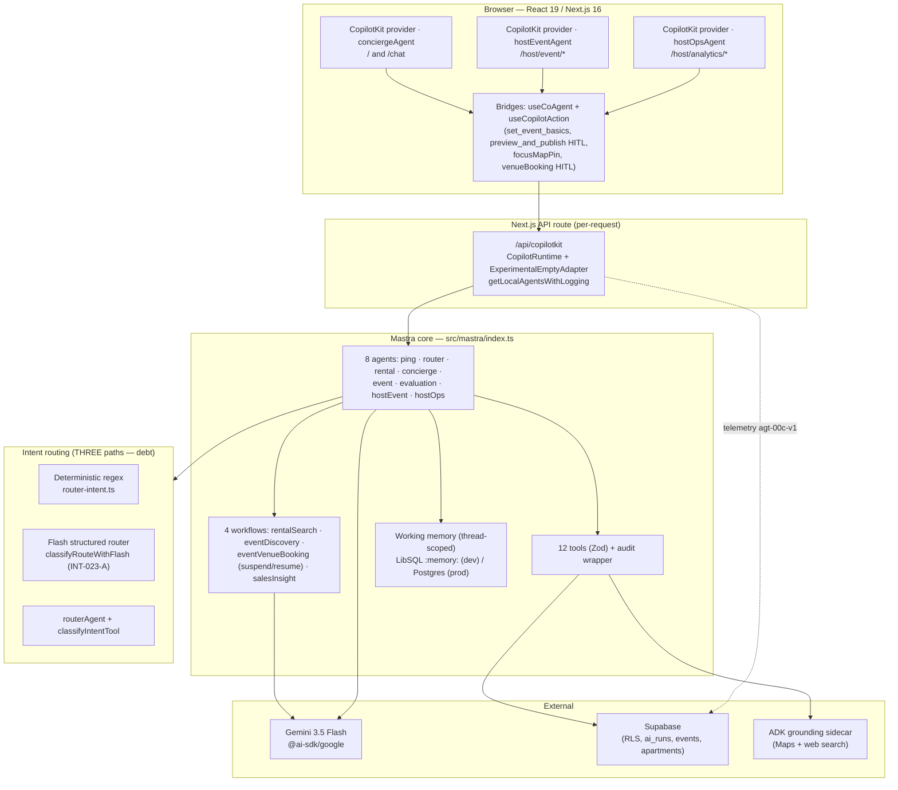
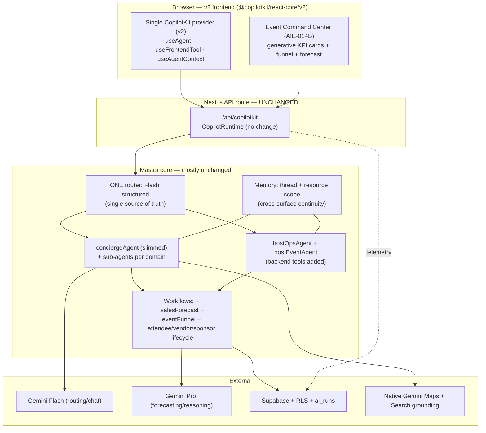

# CopilotKit v1 → v2 + AI-Native Event OS — Deep Architecture Audit

**Date:** 2026-06-12 · **Branch:** `claude/copilotkit-v1-v2-audit-6m50g2` · **Phase:** 1 (MVP launch prep, W6+)
**Scope reviewed:** CopilotKit 1.55.2 wiring, Mastra core (8 agents · 12 tools · 4 workflows), Gemini 3.5 Flash usage, state/memory, observability, Event OS roadmap.
**Method:** Direct source inventory of `src/app/api/copilotkit/**`, `src/components/**`, `src/mastra/**`, `src/lib/**`, cross-checked against the official CopilotKit v2 migration guide.

> **Honesty note.** Scores and findings below are grounded in the code that exists on this branch today. Where a claim depends on a Linear status or a runtime metric I did not measure, it is flagged "unverified." Competitive numbers in Part 6 are directional, not benchmarked.

---

## 1. Executive Summary

**The headline: the v1→v2 migration is a frontend-only swap, not a rewrite — and that single fact changes the entire risk picture.** The official guide is explicit: backend packages (`@copilotkit/runtime`, `CopilotRuntime` config, agent definitions) do **not** change. Everything mdeai invested in — the 8 Mastra agents, 12 tools, 4 workflows, `ai_runs` telemetry, RLS-scoped tools, the per-request runtime bridge — survives untouched. v2 only moves React hooks and UI components from `@copilotkit/react-core` + `@copilotkit/react-ui` into one package, `@copilotkit/react-core/v2`, with renamed hooks.

**What this means in the real world.** Roberto's event wizard, Camila's concierge chat, and Patricia's host analytics keep working exactly as they do now during a migration. The risk is contained to ~10 frontend files (the provider mount + the bridge components), not the agent brain. mdeai does **not** need to choose between "ship Phase 1" and "prepare for v2" — the smart move is to finish Phase 1 on v1 and run a single v2 prototype on the lowest-risk page.

**Where mdeai is genuinely strong (rare for a Phase-1 app):**
- **Deterministic numbers, LLM only narrates.** `salesInsightWorkflow` computes revenue/sell-through in code; Gemini only relays. Host analytics can't hallucinate Roberto's sales. This is a senior pattern most teams skip.
- **Real observability.** Every turn writes `ai_runs` with tool spans, token counts, slowest-tool, and an `agt-00c-v1` telemetry schema. Most CopilotKit apps fly blind.
- **RLS-scoped tools + audit wrapper.** Host tools enforce row-level security and log pre/post/error with risk levels.

**Where it's genuinely weak / red flags:**
- 🔴 **Two routers exist and they disagree in spirit.** A deterministic regex router (`src/lib/router-intent.ts`) AND a Gemini structured router (SAN-872 · INT-023-A `classifyRouteWithFlash`) AND a `routerAgent` with `classifyIntentTool`. Three intent paths is technical debt waiting to drift. Camila's topic-switch correctness (SAN-874) depends on these agreeing.
- 🔴 **`conciergeAgent` is a 318-line god-agent** carrying 8 tools and 8 intents in one prompt. This is the most likely source of latency and routing mistakes, and the hardest thing to evaluate.
- 🟡 **`hostEventAgent` has zero backend tools** (`tools: {}`) — the wizard's `set_event_basics`/`set_venue`/`set_pricing`/`preview_and_publish` live only as frontend `useCopilotAction`s. That works in v1 but is the exact surface most affected by the v2 `useCopilotAction → useFrontendTool` rename.
- 🟡 **Event OS forecasting (SAN-764 · AIE-013) and Command Center (SAN-883 · AIE-014B) have no workflow or memory scaffolding yet** — they're roadmap, not code.

**CTO one-liner:** *Finish Phase 1 on v1, prototype v2 on `/host/analytics` (lowest blast radius), consolidate the three routers before they drift, and treat the Event OS as a workflow-and-memory problem, not a UI problem.*

---

## 2. Scorecard — Current Architecture (out of 100)

| Area | Score | Grade | Explanation |
|---|---|---|---|
| CopilotKit v1 implementation | 86 | 🟢 | Clean Pattern-1 (same-origin runtime), exactly 3 provider mounts, zero v2 contamination, HITL done right. Loses points for 3 separate mounts duplicating wiring and heavy reliance on `useCopilotChatInternal`/`_c` internals that v2 renames. |
| Mastra agent architecture | 72 | 🟡 | Strong tool/workflow separation, thread-scoped memory. Dragged down by the 318-line `conciergeAgent` god-agent and `hostEventAgent` having no backend tools. |
| Tool architecture | 84 | 🟢 | 12 well-typed Zod tools, audit wrapper, RLS scoping, fallback-to-mock resilience. Minor: grounded-search quota logic is spread across tools. |
| Workflow architecture | 80 | 🟢 | 4 workflows with clean compute/narrate and suspend/resume (admin review). Gap: no forecasting or funnel workflow yet. |
| Routing / intent | 58 | 🔴 | **Three overlapping routers.** Deterministic regex + Flash structured router + `routerAgent`. Works today but is the #1 drift risk for Camila's topic-switch. |
| State / working memory | 78 | 🟡 | Per-thread Zod working memory, the "numbers stay out of memory" guardrail is excellent. Three-place schema sync (Zod + TS + packages/types) is fragile and manual. |
| Shared memory / continuity | 70 | 🟡 | Working memory continuity is wired (INT-023-B) but scoped per-thread only; no cross-thread or cross-surface memory (Camila on `/chat` ≠ Camila on `/rentals`). |
| Gemini implementation | 75 | 🟡 | All 8 agents on `gemini-3.5-flash`, centralized in `models.ts`. Good. But everything is Flash — no Pro tier for forecasting/reasoning, and grounding is via a custom ADK sidecar, not native Gemini Maps/Search grounding. |
| Observability | 88 | 🟢 | Best-in-class for a Phase-1 app: `ai_runs` + `agt-00c-v1` telemetry, tool spans, token usage, search logs, scorers (faithfulness, grounding-coverage). |
| AI-native capability (Event OS) | 55 | 🔴 | Concierge side is genuinely AI-native. Event OS side is mostly read-and-narrate analytics; forecasting, funnel, command center, vendor/sponsor/attendee lifecycle are vision, not built. |
| **Weighted overall** | **74** | 🟡 | A well-engineered Phase-1 concierge with a strong observability spine, held back by router sprawl, one god-agent, and an Event OS that is more roadmap than runtime. |

---

## 3. Current Architecture Diagram

---

## 4. Future Architecture Diagram (post-v2, Event OS expanded)

**The only boxes that change colour are in the Browser and inside Mastra's logic. The runtime route, Supabase, RLS, and telemetry spine are identical.**

---

## 5. CopilotKit v1 vs v2 Assessment

### 5.1 The eight questions

1. **What are we doing correctly?** Pattern-1 self-hosted runtime; exactly one mount per surface; zero v1/v2 mixing; HITL via `renderAndWaitForResponse`; generative-UI mirrors with `available:"disabled"`; per-request runtime with audit context. This is textbook-clean v1.
2. **What technical debt exists?** Three provider mounts duplicate boilerplate; heavy use of internal/underscore APIs (`useCopilotChatInternal`, `useDefaultTool`) that v2 reshapes; `hostEventAgent` tools live only on the frontend.
3. **What limitations does v1 create?** Component-override props (`AssistantMessage`, `markdownTagRenderers`) for chat UI are clumsy; two-package frontend (`react-core` + `react-ui`) means version-skew risk; less ergonomic agent-context API.
4. **What becomes easier in v2?** One frontend package; slot-based UI customization (cleaner than prop overrides); `useAgent` unifies `useCoAgent` + `useCopilotChat`; `useFrontendTool`/`useAgentContext` are clearer names.
5. **What becomes harder in v2?** Short term: every bridge file needs hook renames; the chat components leaning on `useCopilotChatInternal` must move to `useCopilotChatHeadless_c`; UI-override props must become slots. It's mechanical but touches the most-tested surfaces.
6. **What should not be migrated (yet)?** The backend — there is nothing to migrate. Also don't migrate `/host/event/new` first; it's the W3–W4 hero with HITL and the most frontend tools.
7. **What should be migrated first?** `/host/analytics` (`hostOpsAgent`) — read-only, one bridge file, lowest blast radius, easy to A/B.
8. **What should never be migrated?** Nothing is "never," but the deterministic regex router and `ai_runs` telemetry are frontend-agnostic and untouched by either version.

### 5.2 Capability table

| Capability | v1 (today) | v2 | Winner |
|---|---|---|---|
| Backend / `CopilotRuntime` | Works, unchanged | Identical, unchanged | **Tie** (no cost to migrate) |
| Frontend packages | `react-core` + `react-ui` (2) | `react-core/v2` (1) | **v2** |
| Agent state hook | `useCoAgent` | `useAgent` (unifies chat+state) | **v2** |
| Frontend tools | `useCopilotAction` | `useFrontendTool` (clearer) | **v2** |
| Agent context | `useCopilotReadable` + `useCopilotAdditionalInstructions` | `useAgentContext` (one hook) | **v2** |
| Chat UI customization | Component-override props | Slot system | **v2** |
| Headless chat | `useCopilotChat` (+ internal `_c`) | `useAgent` / `useCopilotChatHeadless_c` | **v2** (cleaner) but migration touches internals |
| HITL | `renderAndWaitForResponse` | Same pattern, v2 imports | **Tie** |
| Maturity / battle-tested | High (1.55.2, Mastra-blessed) | Newer surface | **v1** (today) |
| Migration cost | — | ~10 frontend files | **v1** wins on "do nothing now" |

**Verdict:** v2 is the better frontend, but the win is incremental and the backend is neutral. There is no architectural forcing function to rush. Migrate when v2 + Mastra are jointly stable (CLAUDE.md already pins this to Phase 2), and prototype now to de-risk.

---

## 6. Real-World Use Cases — v1 flow vs v2 flow

### Roberto — "How are my sales?"
- **Current v1 flow:** `/host/analytics` mounts `hostOpsAgent` via a provider → `useCoAgent("hostOpsAgent")` syncs `HostDashboardState` → user asks → agent calls `getSalesInsightsTool` → tool runs `salesInsightWorkflow` (compute step in code, narrate step in Gemini) → numbers lifted from tool result into state by the bridge (never by the LLM) → 4 `useCopilotAction(available:"disabled")` mirrors render KPI cards.
- **v2 flow:** Identical backend. Frontend becomes `useAgent("hostOpsAgent")` and the 4 mirrors become `useFrontendTool({available:"disabled"})`. KPI cards move from component-override to slots. **Roberto sees no difference; the code is ~30% less boilerplate.**

### Roberto — "How do I sell out this event?"
- **Current flow:** Not really supported. `getSalesInsightsTool` returns `recommendedActions` (priority/action/reason), so Roberto gets *generic* nudges, but there's no forecast, no funnel, no "you'll sell ~62% at this pace — drop tier price or push a 48h promo" reasoning. This is the gap SAN-764 · AIE-013 (Revenue Forecasting) and SAN-883 · AIE-014B (Event Command Center) are meant to fill — **but neither exists in code yet.**
- **Future Command Center flow:** `eventFunnel` workflow (views→cart→paid) + `salesForecast` workflow (Gemini **Pro**, not Flash, for the projection) feed a generative Command Center that says: "At current pace you reach 62% sell-through. Two levers: (a) cut Tier-2 by 15% → +18% projected, (b) 48h email to your 340 past attendees → +12%." HITL approval on each lever. **This is the single highest-value unbuilt capability for Roberto.**

### Camila — "Venue for a birthday party for 30 people"
- **Current routing:** Hits the deterministic regex router (`router-intent.ts`) → `venue_booking` intent (confidence ~0.92) → `conciergeAgent` → `requestVenueBooking` tool → HITL confirm card (`VenueBookingHitlPanel`). Works, but party-size 30 + "birthday" occasion is only weakly modeled (`groupSize`/`occasion` exist in slots but aren't deeply used in search).
- **Future routing:** Single Flash structured router classifies intent + extracts `{occasion: birthday, groupSize: 30}` in one call → a dedicated `venueBookingAgent` (split out of the concierge god-agent) → grounded venue search filtered by capacity ≥ 30 → booking HITL. **Camila gets capacity-aware results instead of generic venues, and the topic-switch (birthday → then "actually, find me an apartment") is clean because there's one router with one memory-reset rule (SAN-874 · INT-023-C).**

---

## 7. Migration Strategy (no full rewrite)

### Phase 0 — No migration. Finish these first.
1. **Consolidate the three routers into one** (the Flash structured router from INT-023-A). Retire `routerAgent`/`classifyIntentTool` or make it call the same classifier. This must happen *before* v2 — router drift is the real risk, not the hook rename. (SAN-874/875/876 depend on it.)
2. **Give `hostEventAgent` real backend tools** so the wizard isn't frontend-only. This both hardens Phase 1 and shrinks the v2 migration surface.
3. **Slim `conciergeAgent`** — split venue/restaurant/rental/event into sub-agents or a tool-router, so the 318-line prompt stops being the latency and eval bottleneck.
4. Ship the Phase-1 heroes on v1: Roberto's wizard, Camila's chat+pins, Andrés's paid ticket.

### Phase 1 — v2 prototype. One page: `/host/analytics`.
**Why this page:** read-only (no HITL publish risk), one bridge file (`host-ops-copilot-bridge.tsx`), `hostOpsAgent` backend is untouched by v2, and it's Patricia/Roberto-facing (internal-ish), so a regression is low-stakes. Migrate `useCoAgent→useAgent`, the 4 mirrors `→useFrontendTool`, swap the package import, and A/B against v1. This proves the slot system and the hook renames with the least blast radius.

### Phase 2 — Hybrid v1 + v2.
v2 ships per-route. Because each surface has its own provider mount, you can run `/host/analytics` on v2 while `/chat` and `/host/event/*` stay v1 — **as long as no single React tree imports from both `@copilotkit/react-core` and `@copilotkit/react-core/v2`.** That's the real meaning of CLAUDE.md's "never mix v1/v2": it's a per-tree rule, not a per-repo rule. The runtime route serves both identically.

### Phase 3 — Full migration.
Move `/chat` (conciergeAgent) and `/host/event/*` (hostEventAgent, with its new backend tools) last, because they carry the most frontend tools and the HITL flows. Delete `@copilotkit/react-ui`. Done.

### Keep / Migrate / Reason

| Component | Keep | Migrate | Reason |
|---|---|---|---|
| `conciergeAgent` | ✅ (refactor, don't migrate) | — | Backend; v2 doesn't touch it. Split for quality, not for v2. |
| `hostEventAgent` | ✅ | — | Backend. Add tools (Phase 0). |
| `hostOpsAgent` | ✅ | — | Backend. First v2 *frontend* prototype target. |
| `salesInsightWorkflow` | ✅ | — | Backend; gold-standard compute/narrate. |
| `eventVenueBookingWorkflow` | ✅ | — | Backend; suspend/resume is correct. |
| Supabase / RLS | ✅ | — | Frontend-version-agnostic. |
| `ai_runs` + `agt-00c-v1` telemetry | ✅ | — | Backend; the observability spine. |
| Provider mounts (3×) | — | ✅ (v2 import) | Frontend; the actual migration work. |
| Bridge components (useCoAgent/useCopilotAction) | — | ✅ (→ useAgent/useFrontendTool) | Frontend hook renames. |
| Chat UI (`@copilotkit/react-ui`) | — | ✅ (→ react-core/v2 + slots) | The biggest v2 surface; do last. |
| Deterministic regex router | ⚠️ Consolidate | — | Not a v2 concern; resolve router sprawl first. |

---

## 8. AI-Native Event OS Assessment

### 8.1 Is the task order correct?
**Mostly, but it's missing its foundation.** The listed order leans UI-first (KPI cards, funnel, hub, command center) when the **data and workflow layer underneath them doesn't exist yet**. Recommended order:

| # | Task | Why this position |
|---|---|---|
| 1 | **SAN-882 · AIE-008B — Host Events OS Hub** | The shell everything else mounts into. Build first. |
| 2 | **SAN-761 · AIE-009 — Generative KPI Cards** | Already half-there (`hostOpsAgent` mirrors). Quick win, builds on existing tools. |
| 3 | **SAN-763 · AIE-010 — Event Analytics Funnel** | **Needs a new `eventFunnel` workflow + funnel events in Supabase — currently missing.** Blocked until instrumentation exists. |
| 4 | **SAN-773 · AIE-020 — Host Bookings Page** | Reuses `eventVenueBookingWorkflow`; mostly UI. |
| 5 | **SAN-764 · AIE-013 — Revenue Forecasting** | **Needs a new `salesForecast` workflow on Gemini Pro + historical sales data.** Highest value, highest new-work. |
| 6 | **SAN-883 · AIE-014B — Event Command Center** | Capstone — composes 1–5. Build last. |

### 8.2 What's missing
- **Missing workflows:** `eventFunnel` (views→cart→paid instrumentation), `salesForecast` (projection on Pro, not Flash), `attendeeLifecycle`, `vendorLifecycle`, `sponsorLifecycle`. Only 4 workflows exist; none cover forecasting or funnel.
- **Missing memory:** Event OS has only `hostOpsMemorySchema` (focusedEventId + narration). No host-level memory that persists "Roberto's goals / promo history / past-event learnings" across threads. Forecasting needs historical context that thread-scoped memory can't hold → add **resource-scoped** memory.
- **Missing AI capability:** No proactive agent (today everything is pull: Roberto must ask). An Event OS should *push* — "sales stalled 3 days, here's a lever." No forecast, no anomaly detection, no auto-generated promo copy.
- **Missing marketplace capability:** No vendor/sponsor matching, no venue marketplace beyond booking requests. The `requestVenueBooking` tool is a lead form, not a marketplace.
- **Missing attendee lifecycle:** No post-purchase journey (reminders, check-in, post-event NPS, rebook). Andrés buys a ticket and disappears from the system.
- **Missing vendor/sponsor lifecycle:** Not modeled at all. These are Phase 2+ but absent from the data model today.

### 8.3 Verdict
The Event OS **vision** is sound and differentiated, but today it's ~30% built: strong read-and-narrate analytics, no forecasting/funnel/lifecycle. Treat it as a **workflow + memory + data-instrumentation** program, not a dashboard program.

---

## 9. Competitive Analysis

| Dimension | mdeai vs the field | Where mdeai stands |
|---|---|---|
| **vs Eventbrite / Luma** (consumer event discovery + ticketing) | They own scale, SEO, payment trust. mdeai owns **AI-native concierge + grounded local search + bilingual Medellín focus.** | Stronger on conversational discovery; weaker on ticketing maturity, payment trust, network effects. |
| **vs Bizzabo / Cvent** (enterprise event management) | They own enterprise workflow depth, integrations, compliance. mdeai owns **AI-first host ops at SMB scale.** | Stronger on "ask your sales a question"; far weaker on enterprise breadth (badging, sessions, sponsors). |
| **vs HubSpot / Salesforce** (CRM/analytics) | They own the system of record. mdeai owns **vertical AI for events specifically.** | Don't compete here; integrate later. |
| **vs Perplexity / Gemini app** (answer engines) | They own general grounded answers. mdeai owns **transactional grounding** — search that ends in a booking/ticket, not just an answer. | Stronger on action; weaker on raw retrieval breadth. |
| **vs CopilotKit / Mastra showcases** (the frameworks themselves) | mdeai is a *reference-quality* user: compute/narrate split, telemetry, RLS tools. | Among the stronger Mastra+CopilotKit production apps; the god-agent is the main anti-pattern. |
| **vs Gemini native grounding** (Maps grounding, Search grounding, structured output, function calling) | mdeai uses a **custom ADK sidecar** for grounding instead of native Gemini Maps/Search grounding. | Weaker: native grounding is cheaper, simpler, better-maintained. **Strongly consider migrating grounding to native Gemini APIs.** |

**Where mdeai is stronger:** conversational, action-ending local discovery; deterministic host analytics; observability.
**Where mdeai is weaker:** ticketing/payment maturity, network effects, enterprise depth, and (self-inflicted) using a custom grounding sidecar over native Gemini grounding.
**What to copy:** Luma's frictionless event-create + RSVP; Eventbrite's payment trust; Perplexity's citation UX (mdeai already has web-citation plumbing).
**What to avoid:** Cvent-style feature sprawl; building a general answer engine (stay transactional).

---

## 10. Final Recommendations

### Top 10 — Immediate (this cycle, W6–W7)
| # | Action | Benefit | User impact | Effort | ROI | Priority |
|---|---|---|---|---|---|---|
| 1 | Consolidate 3 routers → 1 Flash structured router | Kills drift risk | Camila's topic-switch reliable | M | 🟢 High | P0 |
| 2 | Add backend tools to `hostEventAgent` | Hardens wizard, shrinks v2 surface | Roberto's wizard robust | M | 🟢 High | P0 |
| 3 | Split `conciergeAgent` god-agent | Lower latency, evaluable | Camila faster replies | M-L | 🟢 High | P0 |
| 4 | Ship topic-switch regression matrix (SAN-876 · INT-024) | Prevents regressions | Camila | S | 🟢 High | P0 |
| 5 | v2 prototype on `/host/analytics` only | De-risks Phase-2 migration | None (internal) | S | 🟢 High | P1 |
| 6 | Add Flash routing telemetry (SAN-875 · INT-023-D) | See routing decisions in `ai_runs` | Internal | S | 🟢 High | P1 |
| 7 | Wire `attendeeLifecycle` stub (post-purchase reminder) | Closes Andrés's drop-off | Andrés re-engaged | M | 🟡 Med | P1 |
| 8 | Move grounding to native Gemini Maps/Search grounding (spike) | Cheaper, simpler | Tourist/Camila grounded results | M | 🟡 Med | P1 |
| 9 | Generative KPI Cards (SAN-761 · AIE-009) | First Event OS surface | Roberto | S-M | 🟢 High | P1 |
| 10 | Host Events OS Hub shell (SAN-882 · AIE-008B) | Mount point for OS | Roberto | M | 🟢 High | P1 |

### Top 10 — Medium-Term (Phase 1.5 → early Phase 2)
| # | Action | Benefit | Impact | Effort | ROI | Priority |
|---|---|---|---|---|---|---|
| 1 | `eventFunnel` workflow + funnel instrumentation | Real conversion data | Roberto/Patricia | M-L | 🟢 | P1 |
| 2 | `salesForecast` workflow on Gemini **Pro** | Projection, not just history | Roberto "sell out" | L | 🟢 | P1 |
| 3 | Event Analytics Funnel UI (SAN-763 · AIE-010) | Visualize funnel | Roberto | M | 🟡 | P2 |
| 4 | Revenue Forecasting UI (SAN-764 · AIE-013) | Forward-looking | Roberto | M | 🟢 | P1 |
| 5 | Resource-scoped (host-level) memory | Cross-thread continuity | Roberto | M | 🟡 | P2 |
| 6 | Host Bookings Page (SAN-773 · AIE-020) | Manage venue bookings | Roberto/Patricia | M | 🟡 | P2 |
| 7 | Migrate `/chat` + `/host/event/*` to v2 | Single frontend pkg | Internal | M-L | 🟡 | P2 |
| 8 | Proactive nudge agent (push, not pull) | Surfaces levers unasked | Roberto | M | 🟢 | P2 |
| 9 | Capacity/occasion-aware venue search | Better Camila results | Camila | M | 🟡 | P2 |
| 10 | Cross-surface memory (chat ↔ rentals) | Continuity | Camila | M | 🟡 | P2 |

### Top 10 — Long-Term (Phase 2+)
| # | Action | Benefit | Impact | Effort | ROI | Priority |
|---|---|---|---|---|---|---|
| 1 | Event Command Center (SAN-883 · AIE-014B) | The OS capstone | Roberto | L | 🟢 | P1 |
| 2 | Vendor lifecycle + marketplace | New revenue | Roberto/vendors | L | 🟡 | P2 |
| 3 | Sponsor lifecycle | Sponsorship revenue | Hosts/sponsors | L | 🟡 | P3 |
| 4 | Full attendee lifecycle (check-in, NPS, rebook) | Retention | Andrés | L | 🟢 | P2 |
| 5 | Spanish (Phase 2 i18n) | Market fit | All Medellín users | L | 🟢 | P1 |
| 6 | Multi-model tiering (Flash + Pro routing) | Cost/quality balance | All | M | 🟡 | P2 |
| 7 | Anomaly detection on sales | Auto-alerts | Roberto | M | 🟡 | P3 |
| 8 | Auto-generated promo copy + creative | Save host time | Roberto | M | 🟡 | P3 |
| 9 | Native payment trust (Stripe maturity, refunds) | Conversion | Andrés/Miguel | L | 🟢 | P1 |
| 10 | Eval harness expansion (scorers → CI gates) | Quality moat | Internal/Lucía | M | 🟡 | P2 |

---

## 11. Risks

| Risk | Severity | Mitigation |
|---|---|---|
| **Router drift** — 3 intent paths diverge | 🔴 High | Consolidate to one (Immediate #1) before v2. |
| **God-agent latency/eval** — 318-line conciergeAgent | 🔴 High | Split into sub-agents (Immediate #3). |
| **v2 internal-API churn** — chat uses `useCopilotChatInternal`/`_c` | 🟡 Med | Prototype on analytics first; isolate chat migration to Phase 3. |
| **Three-place schema sync** — Zod + TS + packages/types drift | 🟡 Med | Generate types from one source; add a sync test. |
| **Event OS over-promise** — UI tasks scheduled before workflows exist | 🟡 Med | Reorder (Section 8.1): build workflows + data first. |
| **Custom grounding sidecar** — maintenance burden vs native Gemini | 🟡 Med | Spike native Gemini grounding (Immediate #8). |
| **Forecasting on Flash** — Flash may under-reason projections | 🟡 Med | Use Gemini Pro for `salesForecast` only. |
| **v2 maturity** — newer surface, fewer battle scars | 🟢 Low | Stay on v1 for Phase 1; migrate when v2+Mastra jointly stable. |

---

## 12. Recommended Linear Tasks (new)

> Proposed — not yet created in Linear. Titles follow the `SAN-NNN · SPEC-ID — Title` convention; numbers are placeholders.

1. `INT-025 — Router consolidation: single Flash structured router (retire routerAgent + regex duplication)`
2. `AIE-005C — hostEventAgent backend tools (set_event_basics / set_venue / set_pricing / preview_and_publish as Mastra tools)`
3. `INT-026 — conciergeAgent decomposition into domain sub-agents (rental/event/restaurant/venue)`
4. `CK-V2-001 — v2 frontend prototype on /host/analytics (hostOpsAgent), A/B vs v1`
5. `AIE-010A — eventFunnel workflow + funnel event instrumentation (views/cart/paid)`
6. `AIE-013A — salesForecast workflow on Gemini Pro (projection + levers)`
7. `MEM-001 — resource-scoped host memory (goals, promo history, cross-thread)`
8. `LIFE-001 — attendee post-purchase lifecycle stub (reminder + rebook)`
9. `GROUND-001 — spike: native Gemini Maps + Search grounding vs ADK sidecar`
10. `CK-V2-002 — schema single-source-of-truth + drift test (Zod ↔ TS ↔ packages/types)`

---

## 13. Final CTO Recommendation

**Do not rewrite. Do not rush v2. Fix the brain before you reskin the face.**

The migration everyone is anxious about is the *least* of the real work — it's a frontend hook rename across ~10 files, with the entire backend (Mastra, runtime, tools, workflows, telemetry, RLS) sitting untouched. CLAUDE.md's instinct to hold v2 for Phase 2 is correct; the only addition is to run **one** v2 prototype on `/host/analytics` now so Phase 2 is a known quantity.

The genuine risk and the genuine opportunity are both in the agent layer, not CopilotKit:
- **Risk:** three routers and one god-agent. Consolidate the routers and split the concierge *before* anything else. These are what will make or break Camila's experience.
- **Opportunity:** the Event OS is 30% built. The missing 70% is workflows and memory — `eventFunnel`, `salesForecast` (on Pro), and host-level memory — not dashboards. Build the data and reasoning layer, and the KPI cards / funnel / Command Center become thin generative shells on top.

**Sequence:** (1) consolidate routers, (2) backend-tool the host wizard + split concierge, (3) ship Phase-1 heroes on v1, (4) v2 prototype on analytics, (5) build Event OS workflows bottom-up, (6) migrate the rest to v2 in Phase 2.

**Overall architecture grade: 74/100 (🟡) — a well-engineered, well-observed Phase-1 concierge with a clear, low-risk path to a differentiated Event OS, currently held back by router sprawl and one oversized agent. The bones are strong; tighten the spine before you grow the body.**

---

*Sources: CopilotKit v1→v2 migration guide (official); direct source inventory of this branch. Competitive figures are directional. Linear task numbers in §12 are proposals, not created issues.*
