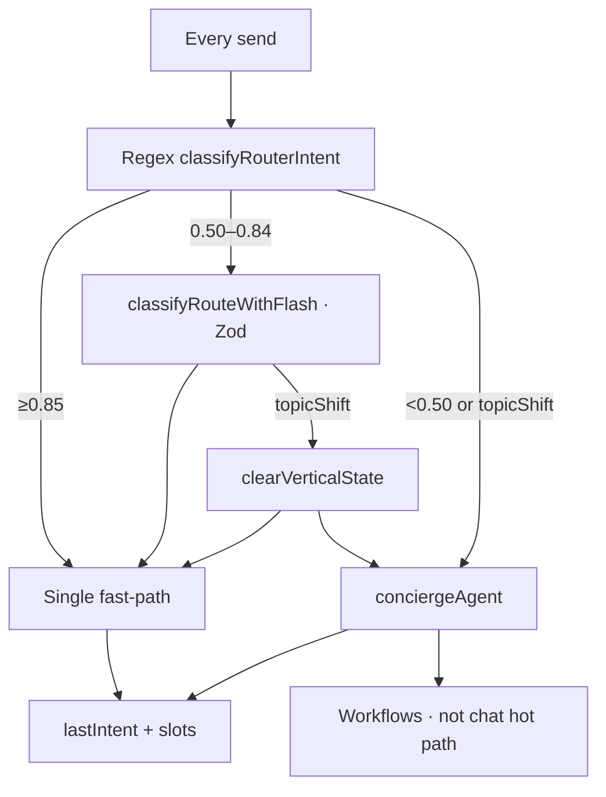
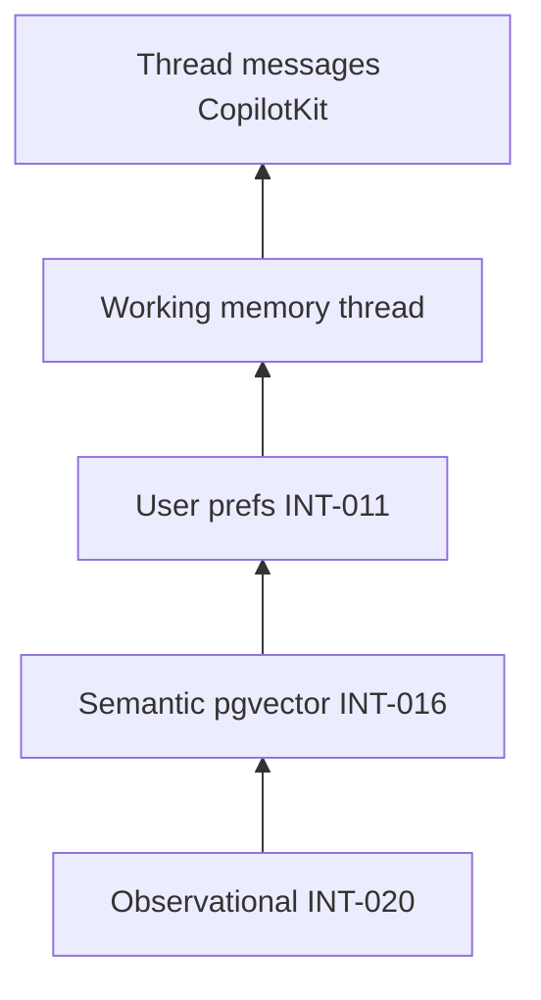
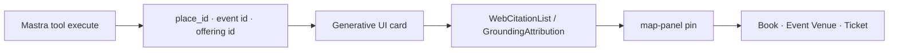
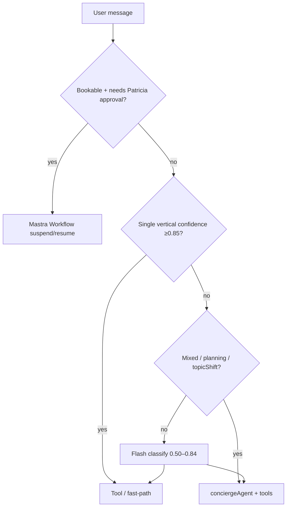

# Deep Research Audit v2 — Gemini + Mastra + mdeai Agent Platform

> **Execution plan:** [`05-agent-plan.md`](./05-agent-plan.md) (canonical) · this file = audit evidence only.

## Executive verdict

**Booking and Patricia approval are production-grade; Camila still loses on ambiguous phrasing and topic switches.**

| State | Score | Meaning |
|-------|------:|---------|
| **Today (`origin/main`)** | **6.7 / 10** | Classify-first send (#175) + VEB workflow spine (#179) + 8-intent router; **no Flash classify**, **no venue UI hook**, **no topic-shift contract** |
| **Target (494-A2 + SAN-871 + SAN-870 + GND)** | **8.5 / 10** | Hybrid **Route → Tools → Agent → Workflow** (Airbnb/Expedia pattern) |

Four layers — not “regex vs Gemini”:

```text
Routing  →  Tools  →  Agent  →  Workflow
```

**Weakest area:** query understanding + topic switch (~4/10). **Highest ROI:** [SAN-494 · EVT-035 — Restaurant card Event Venue CTA](https://linear.app/sanjiovani/issue/SAN-494) **494-A2** (venue UI hook) + [SAN-871 · INT-023 — Gemini Flash structured router + topic switch](https://linear.app/sanjiovani/issue/SAN-871).

### Audit baseline (`origin/main` @ `eea34ef`)

| Check | Result | Verify command |
|-------|--------|----------------|
| Classify-first send | ✅ | `routerHandlerOrderFor()` loop in `concierge-send-user-message.ts` |
| Venue UI hook | ❌ | `git show origin/main:src/components/chat/concierge-chat-input.tsx \| rg EventVenue` → 0 |
| `DAY_TRIP_RE` exported | ✅ | `event-query-classifier.ts` |
| Flash / topic switch | ❌ | No `classifyRouteWithFlash`, `topicShift`, `clearVerticalState` in `src/` |
| Mastra agents registered | 7 | `pingAgent`, `routerAgent`, `rentalAgent`, `conciergeAgent`, `eventAgent`, `evaluationAgent`, `hostEventAgent` |
| Workflows registered | 3 | `rentalSearch`, `eventDiscovery`, `eventVenueBooking` — **no** `concierge-routing-workflow` on main |
| Scorers on live agent | ❌ | `scorers` global registry; not attached in `concierge.ts` |
| Working memory intents | 8 | `venue_booking` in Zod — **synced with router** |
| `classifyRouterIntent` context | ❌ | Signature `(text: string)` only — no `lastIntent` |
| Vitest routing | ✅ 27 pass | `npm test -- --run router-intent concierge-send` |

---

## Part A — Core questions (15)

| # | Question | Answer | Evidence | /10 | Fix | Linear |
|---|----------|--------|----------|----:|-----|--------|
| 1 | Gemini effective? | **Partial** — `gemini-3.5-flash` + strong tool prompts when agent runs; routing never calls Gemini; structured output offline only | `concierge.ts` · scorers | 5 | Flash classify band | SAN-871 |
| 2 | Mastra effective? | **Partial** — tools + CopilotKit bridge strong; 4 dormant agents; scorers/workflows underused on chat | `mastra/index.ts` | 7 | Lean to 2 live agents | SAN-870 |
| 3 | Agents designed? | **Mostly** — concierge + host correct; duplicates drift | 7 registered vs 2 live | 7 | Archive router/rental/event/evaluation | SAN-870 |
| 4 | Tools designed? | **Yes** — Zod, audit wrappers, quota guards, fallbacks | 8 tools on concierge | 8 | Audit wrapper on grounded tool | SAN-870 |
| 5 | Workflows designed? | **Booking yes** — venue WF + suspend; chat WFs not on hot path | `event-venue-booking-workflow.ts` | 8 | Keep Patricia path workflow-only | — |
| 6 | Memory correct? | **Partial** — thread WM works; no prefs/semantic; stateless classify | `conciergeWorkingMemorySchema` | 4.5 | `lastIntent` arg + prefs Phase 2 | INT-010 |
| 7 | Grounding correct? | **MCP-first yes** — Maps 7, Search 5.5 per [`13-grounding.md`](./13-grounding.md) | sidecar + MCP | 6.5 | Viewport bias + cites | SAN-877–880 |
| 8 | Maps correct? | **Good** — field masks, pins, `placeUri`; viewport bias unwired | `search-grounded-places.ts` | 7 | GND-001 locationBias | SAN-877 |
| 9 | Search grounding? | **Gated well, thin UX** — event chain only; sidecar not native tool | MAP-002D chain | 5.5 | GND-003 metadata | SAN-879 |
| 10 | Structured output for routing? | **No** | scorers only use `generateObject` | 2 | `classifyRouteWithFlash` Zod | SAN-872 |
| 11 | Function calling? | **Yes when agent invoked** | Mastra tools mirror CPK actions | 8 | — | — |
| 12 | Natural topic change? | **No** | no `topicShift` / `clearVerticalState` | 3.5 | 023-C + INT-024 | SAN-874, SAN-876 |
| 13 | Better than Gemini/Perplexity for Medellín? | **Inventory + booking yes; NL UX no** | SQL catalogue + Patricia queue | 7 moat / 5 UX | Hybrid routing | SAN-871 |
| 14 | Weakest today? | **Routing understanding + topic switch** | party vs venue failures | — | — | — |
| 15 | Highest ROI? | **494-A2 venue hook + Flash hybrid** | forensic table above | — | — | SAN-494, SAN-871 |

---

## Part B — Competitor benchmark

Compare for **Medellín travel · rentals · events · private venues · restaurants**.

| Competitor | They win at | mdeai wins at | Copy | Avoid |
|------------|-------------|---------------|------|-------|
| **Gemini (Google app)** | NL understanding, Maps grounding in prose, zero setup | **Bookable inventory** (rentals SQL, events, venue offerings), Patricia approval spine, persistent thread on mdeai.co | Structured classify for ambiguous band; cite Maps attribution pattern | Replacing SQL catalogue with generic chat; native Maps on every turn (cost) |
| **Perplexity** | Search-first answers, inline citations, freshness | **Transactional path** — cards → CTA → booking row → admin queue | Citation chip UX (GND-004); log `webSearchQueries` for cost | Search-only answers without `place_id` / slug proof |
| **Mindtrip** | Itinerary UX, saved places, map+cards cohesion ([DESIGN.MD](../../../DESIGN.MD)) | **Local inventory depth** + host publish + venue hire workflow | Card + map panel layout; thread memory for trip context | Building full itinerary planner before routing works |
| **Layla AI** | WhatsApp-native planning, conversational tone | **Web app + map pins + admin ops** for Medellín operators | Warm clarify copy in 0.50–0.84 band (INT-003) | WhatsApp-first Phase 1 (out of scope) |
| **Google Maps** | Geo truth, hours, reviews, near-me | **Curated Medellín verticals** + event/venue DB joins | Viewport `locationBias` on every geo query (GND-001) | Hallucinating venues without Places ID |
| **TripAdvisor** | UGC reviews, trust volume | **Direct booking + AI form-fill** for hosts; faster path to proposal | Trust badges on cards (freshness + source score) | Competing on review corpus Phase 1 |
| **Airbnb Experiences** | Experience conversion funnel, polished checkout | **Private venue hire + events catalogue** in one concierge; Patricia gate | Route → inventory → workflow pattern | Experience-only scope creep |
| **Expedia** | Package search, clarify → refine → checkout | **Multi-vertical Medellín** (rentals + events + food + venues) in one thread | Deterministic lanes + agent for mixed intent | OTA-scale search before routing fixed |
| **Booking.com AI** | Hotel clarify band, structured search slots | **Neighborhood-aware rentals/events** + map pins | Clarify band 0.50–0.84 → agent not canned copy (INT-004) | Hotel-only ontology |

**Competitive advantage score:** **7.5 / 10** current → **9 / 10** target.

**Moat (one sentence):** Medellín **bookable rows** (rentals, ticketed events, venue offerings, `bookings` queue) + **Patricia HITL** beat generic AI prose — but only when **routing sends the user to the right vertical first**.

---

## Part C — Agent architecture review

### Current state (`origin/main`)

```mermaid
flowchart TD
  U[Camila /chat send] --> CI[concierge-chat-input.tsx]
  CI --> SEND[sendConciergeUserMessage]
  SEND --> R[routerHandlerOrderFor]
  R -->|rental| RT[handleRentalMessage]
  R -->|event_venue_booking| EVB_FP[handleEventVenueBookingMessage?]
  EVB_FP -.->|optional no-op| X[❌ hook not wired]
  R -->|event / grounded / restaurant| FP[vertical fast-paths]
  R -->|agent / empty| CK[/api/copilotkit]
  CK --> CA[conciergeAgent · gemini-3.5-flash]
  CA --> TOOLS[8 Mastra tools]
  TOOLS --> UI[Cards + map pins]
  FP --> UI
  CA --> WF[eventVenueBookingWorkflow]
  WF --> PAT[Patricia /admin/event-bookings]
```

### Target state (Phase 1 exit — Option C)



### Option scorecard (1–10, weighted equally)

| Criterion | A Super-agent | B Flash-only | **C Hybrid** | D Specialists | E Supervisor | F Workflow-first |
|-----------|:-------------:|:------------:|:------------:|:-------------:|:------------:|:----------------:|
| Cost | 4 | 3 | **8** | 5 | 2 | 6 |
| Speed (obvious queries) | 5 | 4 | **9** | 7 | 4 | 5 |
| Speed (ambiguous) | 7 | 6 | **7** | 6 | 5 | 4 |
| Reliability obvious | 6 | 7 | **9** | 8 | 6 | 7 |
| Reliability ambiguous | 8 | 8 | **8** | 6 | 7 | 5 |
| UX (Camila topic switch) | 6 | 7 | **8** | 5 | 7 | 4 |
| Maintainability | 5 | 6 | **8** | 4 | 3 | 5 |
| Testability | 5 | 6 | **8** | 5 | 3 | 6 |
| **Weighted avg** | 5.8 | 5.9 | **8.1** | 5.8 | 4.6 | 5.3 |

**Recommendation: Option C (Hybrid router)** — validates [05-agent-plan.md](./05-agent-plan.md) hypothesis. Ship via [SAN-871 · INT-023](https://linear.app/sanjiovani/issue/SAN-871) with `FLASH_ROUTE=1`; keep regex for ≥0.85; agent for mixed/planning/day-trip.

**Reject for Phase 1:** E (supervisor/A2A cost + complexity), F (Patricia HITL must stay workflow-bound).

---

## Part D — Memory architecture audit

### Current layers (`origin/main`)

| Layer | Implementation | Score /10 |
|-------|----------------|----------:|
| Thread history | CopilotKit + Mastra messages (`lastMessages: 20`) | 7 |
| Working memory | Zod in `concierge.ts` — 8 intents, rental/event slots, `mapUi` | 6 |
| UI state | CopilotKit co-agent / map panel | 5 |
| Semantic recall | Not on chat path (INT-016 / pgvector) | 1 |
| User preferences | No `user_preferences` table wired (INT-011+) | 1 |
| Cross-session | F13 Postgres storage adapter partial | 4 |
| Behavioral / observational | INT-020 deferred | 0 |

### Missing (explicit scores)

| Gap | Score impact | Phase |
|-----|--------------|-------|
| Semantic memory across threads | −2 | Phase 2 |
| Prefs (*rooftops, salsa, Laureles, $1000/mo*) | −2 | Phase 2 (INT-011–015) |
| Cross-session return visitor boost | −1 | Phase 2 |
| Topic-switch processors (strip stale card blobs) | −2 | **Phase 1** (SAN-874) |
| `classifyRouterIntent(text, { lastIntent })` | −1.5 | **Phase 1** (SAN-873) |

### Design exercise — Camila over three visits

**Should the system remember Laureles, rooftops, salsa weekends, ~$1000/mo?**

| When | Remember? | Store | Retrieve |
|------|-----------|-------|----------|
| Same thread follow-up (*"show cheaper"*) | **Yes** | Working memory `lastIntent` + slots | Before handler — **SAN-873** |
| New thread same user | **Yes (Phase 2)** | `user_preferences` JSON + RLS by `auth.uid()` | INT-013 inject into agent context |
| Search ranking only | **Optional** | Signals table / MIS | Boost SQL sort — not routing |
| Routing label | **No** | Do not cache intent across threads without re-classify | Every send evaluates fresh keywords |

**Memory tier diagram:**



**Phase boundary:**

| Ships before launch (Phase 1) | Post-MVP (Phase 2) |
|-------------------------------|---------------------|
| WM `lastIntent` + vertical slots (INT-010 polish) | Semantic recall |
| `topicShift` + `clearVerticalState` | Cross-thread prefs |
| Map viewport in WM (INT-009) | Observational memory |
| F13 thread persistence | Preference-driven ranking |

**Memory score:** **4.5 / 10** current → **7 / 10** Phase 1 target → **8.5 / 10** with prefs + semantic.

**Task links:** [INT-010](https://linear.app/sanjiovani/issue/SAN-408) · INT-011–015 · INT-016 · F13.

---

## Part E — Search + Maps excellence

**Principle:** Never make bookable claims without tool evidence ([01-prompt-agent.md](./01-prompt-agent.md)).

### Layer definitions

| Layer | When |
|-------|------|
| **SQL** | Own catalogue: `listings`, `events`, `venue_offerings`, `bookings` |
| **Maps** | Geo discovery, hours, café/nightlife POIs, near-me pins |
| **Search** | Sparse SQL, discovery imports, freshness (*this weekend*, verify) |
| **Agent** | Multi-step, clarify 0.50–0.84, mixed intent, day-trip planning |
| **Direct Gemini answer** | **Never** for bookable entities without tool IDs |

### Routing matrix (ideal + current gap)

| Query type | SQL | Maps | Search | Agent | Example | Current gap |
|------------|:---:|:----:|:------:|:-----:|---------|-------------|
| Rentals | **Yes** | Opt | No | Opt | *1BR Laureles under $80* | 🟢 Strong |
| Events | **Yes** | Opt | **Yes** | Opt | *salsa this weekend* | 🟢 Search gated MAP-002D |
| Restaurants | No | **Yes** | Opt | **Yes** | *quiet rooftop Provenza* | 🟢 Grounded + restaurant tools |
| Cafés | No | **Yes** | No | Opt | *laptop-friendly Laureles* | 🟢 `search-grounded-places` |
| Venues (private hire) | **Yes** | **Yes** | Opt | **Yes** | *birthday venue 30 people* | 🔴 Regex miss *suggest*; hook unwired |
| Weekend / day trip | No | Opt | Opt | **Yes** | *plan my weekend* | 🟢 day_trip → agent (#175) |
| After-dinner / vague | No | Opt | Opt | **Yes** | *what after dinner?* | 🟠 No Flash → wrong fast-path risk |
| Venue + rental combo | Opt | Opt | No | **Yes** | *venue then Airbnb nearby* | 🔴 Single-intent classify only |
| Host / proposal | **Yes** | Opt | No | **Yes** | *book Mamacita for corporate* | 🟡 Tool exists; UI hook missing |

**Gap list vs implementation:**

1. `resolveGroundingLocationBias()` — does not read map viewport from WM ([`13-grounding.md`](./13-grounding.md) · SAN-877).
2. Venue path — `looksLikeEventVenueBookingQuery` misses *suggest venues for a party* (`suggest` ∉ `VENUE_SEEKING_RE`).
3. Web grounding — sidecar only; no `webSearchQueries` count logged (GND-003).
4. No cross-vertical planner — agent must be reached with clean state (INT-023-C).

---

## Part F — Grounding trust architecture

Users must trust cards and booking CTAs (Tourist, Camila, Andrés).

### Trust dimensions

| Score | Definition | How mdeai computes today | /10 | Gap |
|-------|------------|--------------------------|----:|-----|
| **Grounding score** | Answer backed by tool result IDs | Tool returns `place_id`, event id, offering id; cards render from tool JSON | 7 | No runtime scorer on live path |
| **Trust score** | User can verify entity exists | `placeUri`, event slug, `/events/[slug]`, venue offering id on card | 7 | Venue CTA path incomplete (494-A2) |
| **Freshness score** | Hours / event dates current | SQL `starts_at`; web sidecar for sparse events | 6 | No “last verified” UI |
| **Source score** | Visible attribution | `GroundingAttribution.tsx`, `WebCitationList.tsx` | 5.5 | Maps ToS styling incomplete (GND-002) |

### Per entity type — proof on card

| Entity | Proof shown | Pin | CTA |
|--------|-------------|-----|-----|
| **Venue / restaurant** | `google_place_id`, name, neighborhood, Maps link | ✅ AdvancedMarker | Event Venue CTA (494) |
| **Event** | slug, date, venue name, ticket tier | ✅ if geocoded | Book / detail link |
| **Rental** | listing id, price, neighborhood | ✅ | Contact / save |
| **Grounded POI** | place_id, attribution row | ✅ | External Maps link |

### Trust flow



**Mastra scorer thresholds (SAN-870 recommendation):**

| Scorer | Sample rate | Fail threshold | Action |
|--------|-------------|----------------|--------|
| `faithfulness` | 10% prod turns | &lt; 0.7 | Log to `ai_runs`; alert Patricia |
| `grounding-coverage` | 10% grounded tool calls | &lt; 0.8 | Block card render in CI; warn prod |

**Linear:** [SAN-877 · GND-001](https://linear.app/sanjiovani/issue/SAN-877) – [SAN-880 · GND-004](https://linear.app/sanjiovani/issue/SAN-880) · detail in [`13-grounding.md`](./13-grounding.md).

---

## Part G — Workflow audit

**Rule:** Patricia HITL = **Workflow**. Obvious vertical = **Tool**. Mixed/planning = **Agent**.

| Journey | Current (`origin/main`) | Should be | Owner | Evidence |
|---------|------------------------|-----------|-------|----------|
| Venue booking (Camila → Patricia) | WF ✅ · send ✅ · **UI hook ❌** | Tool discover → WF HITL | Camila / Patricia | SAN-501/502 · **494-A2** |
| Rental inquiry | Tool fast-path | Tool (+ agent refine) | Camila | `search_rentals` |
| Event proposal / HITL | WF + CopilotKit modal | Workflow | Roberto / Patricia | SAN-496 |
| Ticket purchase (Andrés) | Checkout partial | Stripe Checkout + wallet | Andrés | [SAN-178 · PAY-001](https://linear.app/sanjiovani/issue/SAN-178) |
| Weekend / day-trip planner | `day_trip_planning` → agent | Agent | Tourist | router-intent.ts |
| Event creation (Roberto) | `hostEventAgent` + CPK HITL | Agent + CPK HITL | Roberto | `/host/event/new` |
| Host onboarding | Shell routes | Agent + forms | Roberto | sitemap MVP shells |
| Partner / venue onboarding | SAN-493 seed data | Data + Patricia admin | Patricia | Mamacita offerings |

### Decision tree



### Orphaned workflows

| File | On `origin/main`? | Registered in `Mastra()`? | Action |
|------|-------------------|---------------------------|--------|
| `concierge-routing-workflow.ts` | **No** (local/dev only) | No on main | **Do not register** — duplicates send-path routing |
| `rental-search-workflow.ts` | Yes | Yes | Keep — offline/batch OK |
| `event-discovery-workflow.ts` | Yes | Yes | Keep — not chat hot path |

### Phase 2 workflow candidates (defer)

| Candidate | ROI | Why defer |
|-----------|-----|-----------|
| Full itinerary workflow | Medium | Needs routing + memory first |
| Stripe ticket finalize workflow | High | SAN-178 track separate |
| WhatsApp handoff workflow | Medium | Phase 2 channel |
| Multi-venue compare workflow | Low | Agent + tools sufficient Phase 1 |

---

## Part H — Scorecard (`origin/main` @ `eea34ef`)

| Category | Current /10 | Target /10 | Evidence pointer | Top fix |
|----------|:-----------:|:----------:|------------------|---------|
| Gemini Usage | 5 | 8 | Agent skipped on fast-path; no Flash | SAN-871 |
| Mastra Usage (core) | 7.5 | 8.5 | Tools + bridge strong | SAN-870 lean |
| Mastra Advanced | 3.5 | 7 | Scorers unwired; 4 dormant agents | SAN-870 scorers |
| Routing | 6 | 8.5 | classify-first ✅; venue hook ❌; no Flash | 494-A2 + SAN-871 |
| Topic Switching | 3.5 | 8 | No topicShift / clearVerticalState | SAN-874 + SAN-876 |
| Memory | 4.5 | 7 | WM yes; stateless classify | INT-010 + SAN-873 |
| Search Grounding | 5.5 | 7.5 | Event-biased sidecar | GND-003 |
| Maps Grounding | 7 | 8 | MCP-first; no viewport bias | GND-001 |
| Tools | 8 | 8.5 | 8 tools, audit wrappers | grounded audit wrap |
| Workflows | 8 | 8.5 | VEB spine shipped | keep chat off WF hot path |
| Rentals | 7.5 | 8 | SQL + fast-path | INT-004 clarify |
| Events | 8 | 8.5 | Catalogue + search chain | party/venue collision |
| Restaurants | 7.5 | 8 | Grounded + restaurant | location bias |
| Venues | 5.5 | 8 | Rules + WF; UI hook missing | 494-A2 + SAN-871 |
| Booking Flow | 8.5 | 9 | #159–#179 spine | 494-D evidence |
| Medellín Expertise | 6 | 8 | Prompt rich; routing limits | Flash + agent path |
| Competitive Advantage | 7.5 | 9 | Inventory moat | routing UX |
| **Overall Product** | **6.7** | **8.5** | This audit | 494-A2 → SAN-871 |

---

## Part I — Hypothesis validation

| Area | v1 expected | **v2 confirmed** | Notes |
|------|------------:|-----------------:|-------|
| Gemini effective usage | 5–6 | **5** | Classify-first helps; still no Flash |
| Mastra core | 7–8 | **7.5** | Tools/workflows strong |
| Mastra advanced | 3–4 | **3.5** | Scorers exist, unwired |
| Routing | 5–7 | **6** | Send wired; venue hook + Flash missing |
| Topic switching | 4–5 | **3.5** | No implementation |
| Search grounding | 6 | **5.5** | Per 13-grounding |
| Maps grounding | 7 | **7** | Viewport gap only |
| Venue booking | 8–9 | **8.5** spine / **5.5** discovery | Split workflow vs Camila UX |
| Rentals | 7 | **7.5** | Stable |
| Events | 8 | **8** | Stable |
| Memory | 3–5.5 | **4.5** | 8-intent Zod synced; no prefs |
| Workflows | 7 | **8** | VEB merged |
| Competitive advantage | 8 | **7.5** | Moat yes; NL UX drags |
| **Overall** | 6.5–7.5 | **6.7** | +0.2 vs v1 (main verified) |

**Top gaps (unchanged):** Flash routing · topic switch · venue UI hook · grounding UX · scorers · prefs (Phase 2).

**Top strengths:** VEB booking spine · events catalogue · Mastra tools · CopilotKit · Medellín SQL inventory · Maps MCP foundation.

---

## Roadmap (Linear-linked)

### P0 — before SAN-497 / prod routing sign-off

| Order | Task | Camila / persona effect |
|------:|------|-------------------------|
| 0 | G6 rebase `origin/main` | Sofía — accurate audit |
| 1 | [SAN-494 · EVT-035](https://linear.app/sanjiovani/issue/SAN-494) **494-A2–D** | Venue cards + CTA from `/chat` |
| 2 | [SAN-871 · INT-023](https://linear.app/sanjiovani/issue/SAN-871) (872–875) | *suggest venues for party* works |
| 3 | [SAN-876 · INT-024](https://linear.app/sanjiovani/issue/SAN-876) | Lucía topic-switch vitest |
| 4 | [SAN-870 · VEB-MVP-009](https://linear.app/sanjiovani/issue/SAN-870) ∥ INT-010 | Faithfulness sample + lean agents |

### P1 — trust + map context

| Task | Effect |
|------|--------|
| SAN-877 · GND-001 | Tourist near-me pins |
| SAN-878–880 · GND-002–004 | Attribution + citations |
| INT-009 | Map viewport in agent WM |

### P2 — defer

| Item | Why |
|------|-----|
| Interactions API | Beta · Phase 2 |
| Supervisor / A2A | Cost + complexity |
| Semantic recall / prefs | INT-011+ after launch |
| SAN-497 eventVenueAgent | After 494 + 871 prod proof |

**Canonical order:** [`docs/events/todo.md`](../../events/todo.md).

---

## Appendices

### A — SAN-494 vs Flash scope

| Deliverable | SAN-494 | SAN-871 Flash |
|-------------|---------|---------------|
| Wire venue UI hook | **494-A2** | — |
| Send classify-first | **494-A1** ✅ main | — |
| Obvious venue regex | 494-C | — |
| *suggest venues for party* | partial | **primary** |
| `topicShift` + clear state | — | **023-C** |
| Class U evidence | 494-D | INT-023 Class U |

### B — Document index

| Doc | Role |
|-----|------|
| **16-agent-research-2026-06-11.md** (this file) | **v2 audit output** — Parts A–I complete |
| [15-mde-agentplan.md](./15-mde-agentplan.md) | Audit prompt |
| [10-agent-research.md](./10-agent-research.md) | v1 domain audit + routing matrix |
| [13-grounding.md](./13-grounding.md) | Search + Maps deep dive |
| [05-agent-plan.md](./05-agent-plan.md) | Execution plan |
| [06-agent-summary.md](./06-agent-summary.md) | Stakeholder scorecard |

### C — Local checkout override

**Branch audited for baseline:** `origin/main` only. If your checkout is `ai/san-495-*` or similar, re-run G6 before debugging — local may differ from table above.

---

## Final verdict

| Question | Answer |
|----------|--------|
| Are we using Gemini + Mastra well? | **Partially** — strong tools/workflows; weak routing intelligence |
| Architecture recommendation? | **Option C hybrid** — rules + Flash + agent |
| Biggest product risk? | Camila gets **wrong vertical** before tools run |
| Biggest product strength? | **Patricia booking spine** on real Medellín inventory |
| Next PR? | **494-A2** venue hook + **494-D** Class U evidence |

**Overall: 6.7 / 10 today → 8.5 / 10** after 494-A2 + SAN-871 + SAN-870 + GND P1.
