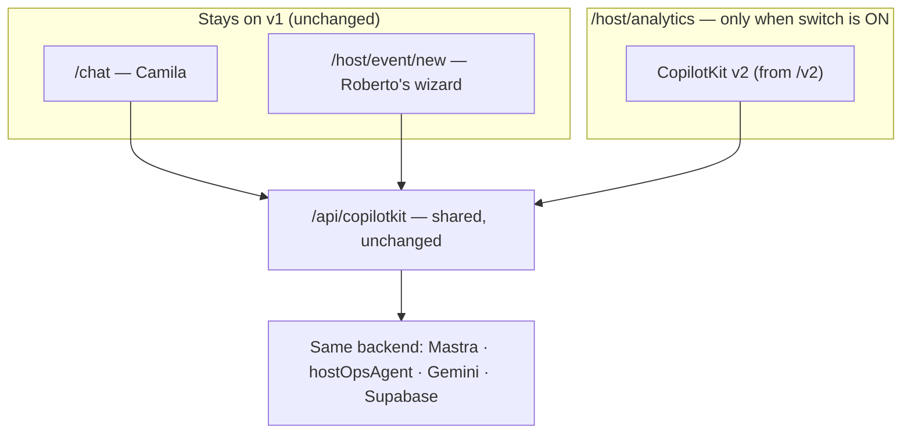

# SAN-888 · CK-V2-002 — v2 prototype on /host/analytics — CopilotKit v2 Host Analytics Prototype (Plan)

**Plain-language plan. Read the top 6 lines and you know the decision.**

**What this is:** a small, safe test of CopilotKit v2 on ONE page — `/host/analytics` (Roberto's "how are my sales?" dashboard) — behind an on/off switch.
**Decision: GO. Low risk.** We can do it without upgrading anything, without touching the backend, and without touching Camila's chat or Roberto's event wizard.
**Why it's safe:** the version we already use (CopilotKit 1.55.2) already includes v2. So this is a few new files behind a flag, not an upgrade.
**Rollback:** flip the switch off (instant), or delete 4 new files. No existing file is rewritten.

---

## The one thing that makes this safe

We checked the actual installed package. **CopilotKit 1.55.2 already ships the v2 code** (under `@copilotkit/react-core/v2`). So:
- No version bump. No `package.json` change. No new dependency.
- No conflict with the "pinned at 1.55.2" house rule.
- The backend (the agent brain, the database, the API) is **not touched at all** — the official guide confirms v2 is a front-end-only change.

In real terms: **Roberto's sales dashboard keeps working exactly as today; we're just rendering it with the newer front-end toolkit on one page to prove it works before doing the rest later.**

---

## Important warning — two different "v2"s exist

We installed the official `copilotkit-upgrade` skill. **Heads up: that skill describes a more aggressive v2 than the one we should use here.** Don't follow it blindly.

| Topic | The skill says (full rewrite) | What we actually do (safe path) | Follow the skill? |
|---|---|---|---|
| Hook renames | `useCopilotAction→useFrontendTool`, `useCopilotReadable→useAgentContext`, `useCoAgent→useAgent` | Same | ✅ Yes |
| Package | Move to a new `@copilotkit/react` package | Use `@copilotkit/react-core/v2` (already installed) | ❌ No |
| Provider | Rename to `CopilotKitProvider` | Keep `<CopilotKit>`, import from `/v2` | ❌ No |
| Backend/runtime | Rewrite to a new runtime | **Leave it alone** (this would break our Mastra agent setup) | 🔴 Never |

**Bottom line:** use the skill only for the hook renames. Ignore its package/provider/runtime sections — they're for a different, bigger migration that would break the agent backend.

---

## Files

**Today's setup for `/host/analytics` (4 files):**

| File | What it does |
|---|---|
| `src/app/host/analytics/layout.tsx` | Turns the dashboard's AI on for this page |
| `src/lib/copilotkit-client-props.ts` | Shared settings (don't edit — used by other pages too) |
| `src/components/host/host-ops-copilot-bridge.tsx` | Holds the sales numbers, talks to the `hostOpsAgent` |
| `src/components/host/host-analytics-shell.tsx` | The dashboard layout + chat box |

**Plan: copy, don't change.** Make v2 copies, leave the originals untouched, and let the page pick which version to show based on the switch.

| Action | File | Note |
|---|---|---|
| Change (1 line of logic) | `src/app/host/analytics/layout.tsx` | Pick v1 or v2 based on the flag |
| Add | `host-analytics-provider-v1.tsx` | The current mount, moved out so v1 stays isolated |
| Add | `host-analytics-provider-v2.tsx` | v2 version of the mount |
| Add | `host-ops-copilot-bridge-v2.tsx` | v2 version, same sales-number guardrail |
| Add | `host-analytics-shell-v2.tsx` | v2 version of the layout + chat |

**The switch:** `COPILOTKIT_V2_ANALYTICS=1` turns v2 on. Unset (the default) = today's v1. So production is safe unless someone deliberately turns it on.

---

## Steps (in order)

1. **Check the v2 hook shapes first.** The renames are known, but the exact way `useAgent` and `useFrontendTool` are called may differ slightly from v1. Confirm against the v2 reference before writing code. This is the only real unknown.
2. Move today's mount into the v1 file (no behavior change).
3. Write the 4 v2 files using the confirmed shapes; keep the rule that **sales numbers come from the tool, never from AI text**.
4. Add the on/off switch to the layout.
5. Run with the switch on; walk the checklist below.
6. Save Playwright (automated browser test) evidence with the switch both on and off.

---

## How v2 fits in (diagram)

---

## Risks

| Risk | How bad | What we do about it |
|---|---|---|
| v2 hooks are called slightly differently than v1 | Medium | Confirm the exact shapes before coding (Step 1) |
| The "show results" pattern works differently in v2 | Medium | Check the v2 reference; adjust if needed |
| Old + new styles clash | Low | New styles load only on this one page |
| Switch left on by accident in production | Low | Default is off; it's opt-in |

---

## Rollback

1. **Fast:** turn the switch off → back to today's version instantly, no deploy needed.
2. **Full:** delete the 4 new files and undo the 1-line switch. Nothing in the original files was changed.

---

## Success checklist (what "done" means)

- `/host/analytics` loads with the switch on
- Roberto asks "how are my sales?" → the `hostOpsAgent` answers
- The sales-insights workflow runs (a row appears in `ai_runs`)
- The KPI cards fill in
- The numbers come from the tool, not from AI-written text (the guardrail holds)
- Camila's `/chat` still works
- Roberto's `/host/event/new` wizard still works
- Lint, type-check, and tests pass (`npm run floor`)
- Playwright evidence saved under `docs/tasks/testing/evidence/SAN-888/`

---

## Recommendation

**Build it — on its own branch and PR, not on the audit PR.** This is its own piece of work (`SAN-888 · CK-V2-002 — v2 prototype on /host/analytics`) and deserves a focused, easy-to-review PR. The audit PR (#206) stays a docs-only review; this prototype is the first real v2 code.
